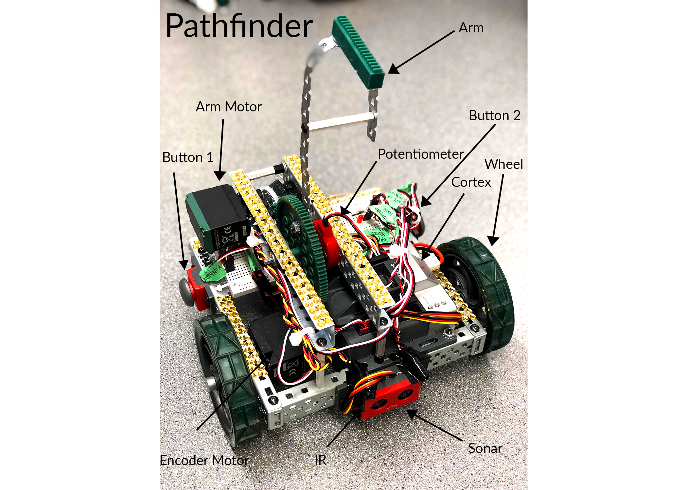
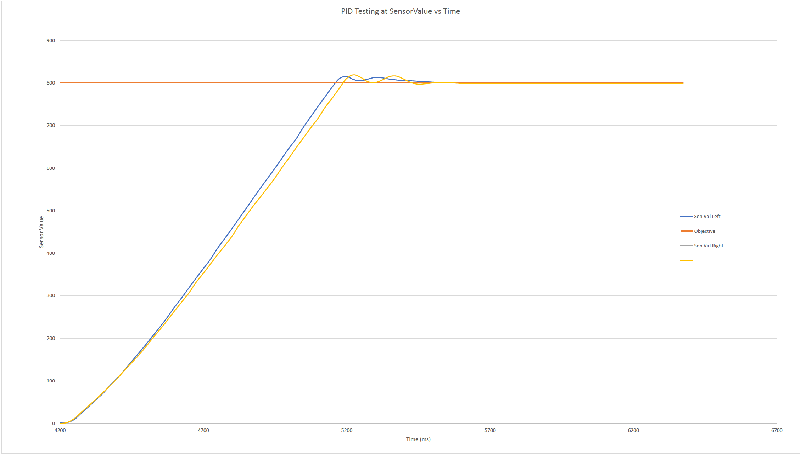

# Pathfinder

Pathfinder is an Underwater Cable Connecting Robot Prototype submitted to the Ocean Networks Canada 2019 University Challenge. My role in this project was Capitan and Software developer; this included developing all Robot C source code to complete the task.

## About

Ocean Networks Canada is an ocean environmental company that focuses on gathering ecological data for countries to make informed decisions that could affect the global environment. To give accurate and reliable information, they have many sensors, some of which are kept underwater for a long time. Upon installing a new sensor, it must be connected to the rest of the network via cables to nodes or central control systems. Under intense pressure at extreme depths, a human can't make this connection. Currently, they use a tethered robot that an operator in a submarine control to make these connections.

To explore making these connections autonomously, ONC created a challenge for the students of the University of Victoria. This challenge consists of a dry-land prototype of a robot to perform the following task autonomously:


### Tasks

* Connect cable to IR beacon (simulating new sensor) from 1ft away!
* Connect cable to IR beacon from 3ft away
* Connect cable to IR beacon from 7ft away

For this challenge the robot must be built with the given VEX parts with the following requirements.

## Requirements
*	Robot must operate in a 7ft-by-7ft zone
*	Robot must be made with the given vex parts
*	Robot must be autonomously driven
*	Robot must connect a cable to an IR sensor
*	Robot must perform the task relatively fast (under 1 min on each trial)	

## Methodologies

The team came up with a three-wheel robot (Pathfinder) with a single arm to which the cable was attached, and upon actuation, the robot performed the connection.



From the software side of this project, the critical part of this challenge was to design a software system to control a robot to interface with its environment in a predictable, accurate, and consistent way. For this, a widespread algorithm in robotics and physical systems control called a Proportional Integral Derivative was a great solution.
PID

Since ONC simplified the environment for this project, the most challenging interface was between the robot and the flat surface. This task required the robot to read the IR emitter, position itself accurately, and move towards the target. With this in mind, the following positional PID for one of the wheels:

### C Code

Below is the PID feedback cycle for one of the drive train wheels.
```c
while (true){

  //intialize error as the differance from the true value and the target
  error = leftDriveTrainEncoderTarget - (SensorValue[leftDTSensor]);
  //calculate the real time integral as an increment of the slices of error under the the SensorValue vs time curve
  integral += error;

  //calculate the real time derivitive by calculating the difference between the error and previos error
  derivative = error - errorPrevious;

  //To prevent integral wind up limmit how big the intgral can get
  if(abs(integral) > INTEGRAL_LIMIT){
    integral = sgn(integral) * INTEGRAL_LIMIT;
  }

  //assign the respective gains
  int pGain = KP * error;
  int iGain = KI * integral;
  int dGain = KD * derivative;

  // add all the gains to make the power
  power = pGain + dGain + iGain; //+ iGain + dGain;
  //writeDebugStream("%-5d %-5d\n" , dGain, power);

  //limit the power to avoid skid
  if(abs(power) > MAX_POWER){
    power = sgn(power) * MAX_POWER;
  }
  //assign power to the motor
  motor[leftDT] = power;

  //save the previous error for next loop
  errorPrevious = error;

  wait1Msec(10);
}
```

### Tuning

When it comes to PID tuning is the hardest part. For this I used the Ziegler Nicolas Method of tuning. Although not perfect gets the PID to a close enough target that allows small manual adjustments. This resulted in the following response for one of the wheels.



## Setup

### Materials
*	1 pathfinder robot (with arm based vex cortex)
*	1 IR beacon
*	1 cable dispenser

Our team set up a pole with a fishing line upon starting the challenge to simulate the cable in the scenario. To the end of the rope was a magnet that we fastened to the robot's arm. When the trial started, the robot would connect the string to the beacon for each evaluation.

## Evaluation Results

The robot was evaluated in three challenges as seen in the animations below.

### Short


### Long


### Tracking


Since the robot completed all challenges with no failures, and all tasks satisfied we were rewarded with a 100% evaluation score. 

## Things I learned

* How to design software for a physically constraint system
*	How to collaborate with a team of like-minded Engineers 
*	How to implement a control algorithm to control physical systems

